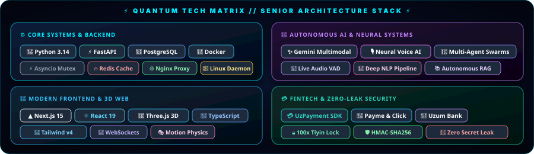

<div align="center">

<!-- 3D COSMIC HOLOGRAPHIC BANNER -->


<br/><br/>

<!-- DYNAMIC TYPING TEXT -->
<a href="https://github.com/salomh46-rgb">
  
</a>

<br/><br/>

<!-- SOCIAL & QUICK CONTACT BADGES -->
<p align="center">
  <a href="https://github.com/salomh46-rgb?tab=followers" target="_blank">
    
  </a>
  &nbsp;
  <a href="https://bestportfoliyo-o4z2.vercel.app/" target="_blank">
    
  </a>
  &nbsp;
  <a href="mailto:salomh46@gmail.com">
    
  </a>
  &nbsp;
  <a href="https://t.me/Ovozli_SavdoBOT" target="_blank">
    
  </a>
  &nbsp;
  
</p>

</div>

---

### 🛰️ AUTONOMOUS TELEMETRY & ARCHITECTURAL PROTOCOLS

<div align="center">
  
</div>

---

### 🚀 3D GOLOGRAFIK FLAGMAN LOYIHALAR (FEATURED MASTERPIECES)

<div align="center">
  
</div>

<br/>

<div align="center">
  <a href="https://github.com/salomh46-rgb/jasper-voice-copilot" target="_blank">
    
  </a>
  &nbsp;
  <a href="https://t.me/Ovozli_SavdoBOT" target="_blank">
    
  </a>
  &nbsp;
  <a href="https://github.com/salomh46-rgb/uzpayment-sdk" target="_blank">
    
  </a>
  &nbsp;
  <a href="https://github.com/salomh46-rgb/pulseapi-monitoring" target="_blank">
    
  </a>
</div>

---

### ⚡ QUANTUM TEXNOLOGIYALAR MATRITSASI (TECH ARSENAL)

<div align="center">
  
</div>

---

### 🌌 TIZIMLAR ME'MORI PROFILI (ENGINEERING IDENTITY & SPEC)

```typescript
interface SeniorArchitectIdentity {
  name: "Javohirbek Asqarov (Jasper)";
  role: "Senior Full-Stack & Autonomous AI Systems Architect";
  coordinates: "Tashkent, Uzbekistan 🇺🇿 [41.2995° N, 69.2401° E]";
  core_foundations: ["Python 3.14", "TypeScript", "Next.js 15", "FastAPI", "Docker", "PostgreSQL", "Redis"];
  ai_specializations: ["Google Gemini Multimodal AI", "Neural Voice (TTS/STT)", "Autonomous Agentic Swarms"];
  methodology: "Senior Architect 5-Step Discipline: Specs First ➔ Mutex Locks ➔ 100% Test Proof ➔ Zero Slop ➔ 1-Click DevOps";
  mission: "Murakkab biznes va texnik infratuzilmalarni yuqori unumdorlikka ega AI tizimlari bilan to'liq avtomatlashtirish.";
  current_focus: "⚡ Building autonomous SaaS ecosystems, multi-agent frameworks, and high-scale FinTech engines";
}
```

---

### 🐍 JONLI FAOLIYAT ILONI (CONTRIBUTION SNAKE)

<div align="center">
  <picture>
    <source media="(prefers-color-scheme: dark)" srcset="https://raw.githubusercontent.com/salomh46-rgb/salomh46-rgb/output/github-contribution-grid-snake-dark.svg">
    <source media="(prefers-color-scheme: light)" srcset="https://raw.githubusercontent.com/salomh46-rgb/salomh46-rgb/output/github-contribution-grid-snake.svg">
    
  </picture>
</div>

---

### 🎮 PACMAN DEV ARCADE (CONTRIBUTION GAME)

<div align="center">
  
</div>

---

### 📊 GITHUB JONLI ANALITIKA VA STATISTIKA (ANALYTICS DASHBOARD)

<div align="center">
  
  
</div>

<div align="center">
  
</div>

---

### 🏎️ FAOLIYAT MAGISTRALI (TURBO DRIFT HIGHWAY)

<div align="center">
  
</div>

---

<br/>

<div align="center">
  <b>✨ "Writing clean code today to power intelligent systems tomorrow." ✨</b><br/>
  <sub>© 2026 Javohirbek Asqarov (Jasper) • Senior Full-Stack &amp; Autonomous AI Systems Architect</sub>
</div>
