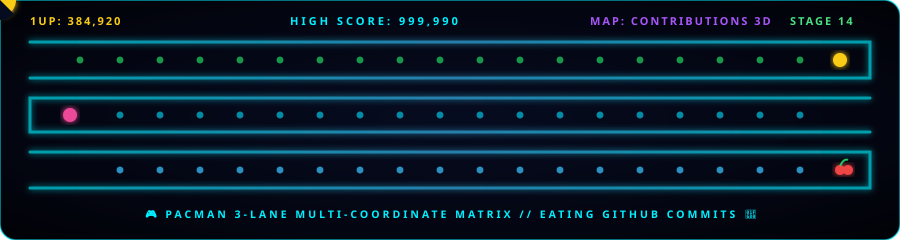
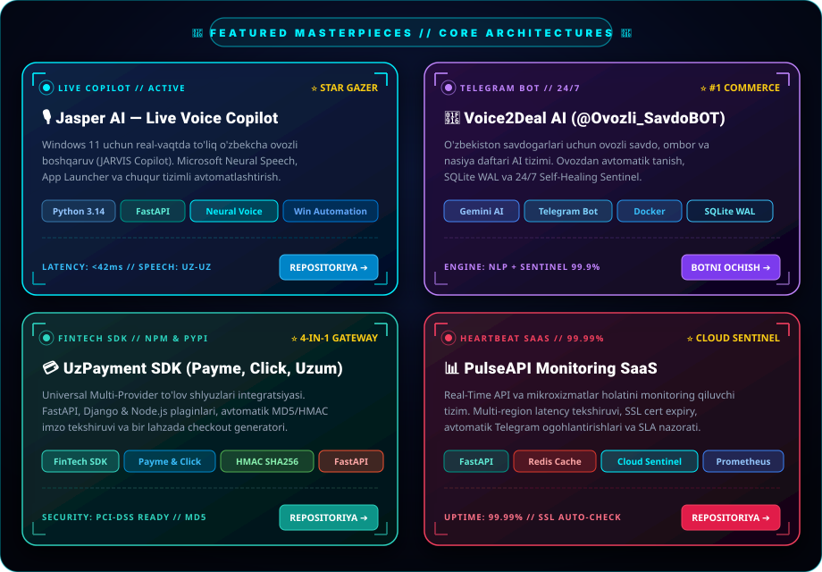

<div align="center">

<!-- 3D COSMIC HOLOGRAPHIC BANNER -->


<br/><br/>

<!-- DYNAMIC TYPING TEXT -->
<a href="https://github.com/salomh46-rgb">
  
</a>

<br/><br/>

<!-- SOCIAL & QUICK CONTACT BADGES -->
<p align="center">
  <a href="https://github.com/salomh46-rgb?tab=followers" target="_blank">
    
  </a>
  &nbsp;
  <a href="https://bestportfoliyo-o4z2.vercel.app/" target="_blank">
    
  </a>
  &nbsp;
  <a href="mailto:salomh46@gmail.com">
    
  </a>
  &nbsp;
  <a href="https://t.me/Ovozli_SavdoBOT" target="_blank">
    
  </a>
  &nbsp;
  
</p>

</div>

---

### 🎮 PACMAN DEV ARCADE (GitHub Contribution Game)

<div align="center">
  
</div>

---

### ⚡ 3D Dinamik Harakatlanuvchi Texnologiyalar (Live Tech Carousel)

<div align="center">
  
</div>

<br/>

<div align="center">
  
</div>

---

### 🌌 Men haqimda (Engineering Architecture & Bio)

```typescript
interface DeveloperIdentity {
  name: "Javohirbek Asqarov (Jasper)";
  role: "Full-Stack Architect & AI Systems Engineer";
  location: "Tashkent, Uzbekistan 🇺🇿";
  core_stack: ["Python 3.14", "TypeScript", "Next.js 14", "FastAPI", "Docker", "PostgreSQL"];
  ai_specialization: ["Google Gemini Multimodal AI", "Neural Voice (TTS/STT)", "Autonomous Agentic Systems"];
  mission: "Murakkab biznes va texnik jarayonlarni AI hamda yuqori unumdorlikka ega dasturlar bilan avtomatlashtirish.";
  status: "🚀 Building next-generation Autonomous SaaS & FinTech Platforms";
}
```

---

### 🚀 3D Golografik Loyihalar Ko'rgazmasi (Holographic Showcase)

<div align="center">
  
</div>

<br/>

<div align="center">
  <a href="https://github.com/salomh46-rgb/jasper-voice-copilot" target="_blank">
    
  </a>
  &nbsp;
  <a href="https://t.me/Ovozli_SavdoBOT" target="_blank">
    
  </a>
  &nbsp;
  <a href="https://github.com/salomh46-rgb/uzpayment-sdk" target="_blank">
    
  </a>
  &nbsp;
  <a href="https://github.com/salomh46-rgb/pulseapi-monitoring" target="_blank">
    
  </a>
</div>

---

### 📊 GitHub Jonli Statistika va Metrikalar (Analytics Dashboard)

<div align="center">
  
  
</div>

<div align="center">
  
</div>

---

### 🏎️ GitHub Faollik Magistrali (Turbo Drift Supercar Highway)

<div align="center">
  
</div>

---

<br/>

<div align="center">
  <b>✨ "Writing clean code today to power intelligent systems tomorrow." ✨</b><br/>
  <sub>© 2026 Javohirbek Asqarov (Jasper) • Full-Stack & AI Systems Architect</sub>
</div>
