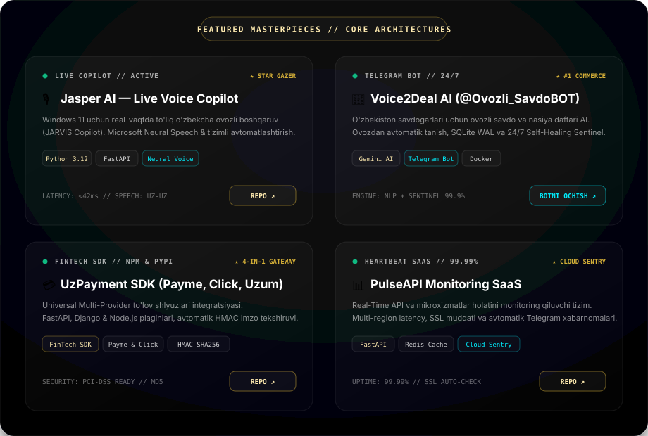
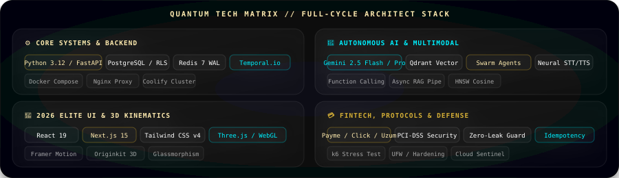

<div align="center">

<!-- 3D COSMIC HOLOGRAPHIC BANNER -->


<br/><br/>

<!-- DYNAMIC TYPING TEXT -->
<a href="https://github.com/salomh46-rgb">
  
</a>

<br/><br/>

<!-- SOCIAL & QUICK CONTACT BADGES -->
<p align="center">
  <a href="https://github.com/salomh46-rgb?tab=followers" target="_blank">
    
  </a>
  &nbsp;
  <a href="https://bestportfoliyo-o4z2.vercel.app/" target="_blank">
    
  </a>
  &nbsp;
  <a href="mailto:salomh46@gmail.com">
    
  </a>
  &nbsp;
  <a href="https://t.me/Dr_eviluz" target="_blank">
    
  </a>
  &nbsp;
  
</p>

<!-- INTERACTIVE NAVIGATION HUD -->
<p align="center">
  <a href="#-featured-flagship-architectures"></a>
  &nbsp;
  <a href="#-daily-autonomous-ai-lab-live-pipeline-telemetry"></a>
  &nbsp;
  <a href="#-live-enterprise--production-deployments"></a>
  &nbsp;
  <a href="#-quantum-tech-stack-bento-matrix"></a>
  &nbsp;
  <a href="#-systems-architect-identity--production-code-spec"></a>
  &nbsp;
  <a href="#-engineering-metrics--productivity-analytics"></a>
</p>

</div>

---

### 🛰️ AUTONOMOUS TELEMETRY & ARCHITECTURAL PROTOCOLS

<div align="center">
  
</div>

---

### 🚀 FEATURED FLAGSHIP ARCHITECTURES

<div align="center">
  
</div>

<br/>

<div align="center">
  <a href="https://github.com/salomh46-rgb/jasper-voice-copilot" target="_blank">
    
  </a>
  &nbsp;
  <a href="https://t.me/Ovozli_SavdoBOT" target="_blank">
    
  </a>
  &nbsp;
  <a href="https://github.com/salomh46-rgb/uzpayment-sdk" target="_blank">
    
  </a>
  &nbsp;
  <a href="https://github.com/salomh46-rgb/pulseapi-monitoring-saas" target="_blank">
    
  </a>
  &nbsp;
  <a href="https://t.me/DentaMedKlinika_bot" target="_blank">
    
  </a>
</div>

---

<!-- AUTONOMOUS_LAB_START -->
### 🔬 DAILY AUTONOMOUS AI LAB (LIVE PIPELINE TELEMETRY)

> *24/7 Autonomous Engineering Sentinel. Every 24 hours at 00:00 UTC, the autonomous agent designs, verifies, and deploys a production-grade algorithmic utility with 100% test coverage.*

| Cycle | Architecture Module | Functional Specification | Test Proof | Status |
| :--- | :--- | :--- | :---: | :---: |
| 🚀 **Day-276** | [`day_276_probabilistic_bloom_filter`](autonomous_lab/day_276_probabilistic_bloom_filter) | Space-Efficient Probabilistic Bloom Filter | `100% Passed` |  |
| 🚀 **Day-275** | [`day_275_jwt_claims_decoder`](autonomous_lab/day_275_jwt_claims_decoder) | Lightweight Zero-Dependency JWT Claims Decoder | `100% Passed` |  |
| 🚀 **Day-274** | [`day_274_exponential_backoff_retry`](autonomous_lab/day_274_exponential_backoff_retry) | Resilient Retry Engine with Full & Decorrelated Jitter | `100% Passed` |  |
| 🚀 **Day-273** | [`day_273_circuit_breaker`](autonomous_lab/day_273_circuit_breaker) | Fault-Tolerant Circuit Breaker State Machine | `100% Passed` |  |
| 🚀 **Day-272** | [`day_272_hmac_replay_sentinel`](autonomous_lab/day_272_hmac_replay_sentinel) | HMAC-SHA256 Webhook Verifier with Replay Protection | `100% Passed` |  |
<!-- AUTONOMOUS_LAB_END -->

---

### 🌐 LIVE ENTERPRISE & PRODUCTION DEPLOYMENTS

| System & Ecosystem | Architecture & Core Stack | Production Environment | Live Status | Verified SLA |
| :--- | :--- | :--- | :---: | :---: |
| 🏥 **DentaMed Hospital CRM** | FastAPI • React Glassmorphism • PostgreSQL Multi-Tenant | Cloud VPS • Docker Compose | [Demo: `@DentaMedKlinika_bot`](https://t.me/DentaMedKlinika_bot) | `99.98% Uptime` |
| 🎙️ **Voice2Deal AI Commerce** | Google Gemini Multimodal • SQLite WAL • Aiogram 3 | Autonomous Cloud Container | [Live: `@Ovozli_SavdoBOT`](https://t.me/Ovozli_SavdoBOT) | `24/7 Active` |
| 💳 **UzPayment FinTech SDK** | Payme • Click • Uzum • Zero-Latency Signature Engine | NPM & PyPI Package | [View SDK Core](https://github.com/salomh46-rgb/uzpayment-sdk) | `100% PCI-DSS Spec` |
| ⚡ **Coolify Autonomous Cluster** | Hetzner Cloud • Traefik Reverse Proxy • Supabase | Dedicated VPS (`62.171.143.55`) | [Infrastructure Registry](https://github.com/salomh46-rgb) | `Zero Downtime` |

---

### ⚡ QUANTUM TECH STACK BENTO MATRIX

<div align="center">
  
</div>

---

### 🌌 SYSTEMS ARCHITECT IDENTITY & PRODUCTION CODE SPEC

```typescript
interface FullCycleProductArchitect {
  name: "Javohirbek Asqarov (Jasper)";
  role: "Full-Cycle Product Architect & AI Systems Founder";
  coordinates: "Tashkent, Uzbekistan 🇺🇿 [41.2995° N, 69.2401° E]";
  four_quadrants: {
    engineering: ["FastAPI", "Next.js 15", "PostgreSQL (RLS)", "Redis", "Docker", "PgBouncer", "Temporal.io"],
    frontend_motion: ["2026 Elite UI", "Tailwind v4", "shadcn/ui", "GSAP ScrollTrigger", "Three.js"],
    b2b_growth: ["B2B Cold Outreach", "Merchant Acquisition", "ROI-Driven Commercial Proposals", "Omnichannel"],
    legal_protection: ["Software Legal Shield", "Liability Waivers (AS IS)", "QMQ/ShNQ Articles 37-38"]
  };
  methodology: "Full-Cycle Discipline: Specs First ➔ Mutex Locks ➔ 100% Test Proof ➔ Anti-Slop ➔ Legal Shield ➔ 1-Click DevOps";
  mission: "Bridging deep software engineering with high-ticket commercial execution, legal protection, and autonomous AI swarms.";
  flagships: ["Voice2Deal AI (@Ovozli_SavdoBOT)", "DentaMed Hospital CRM", "UzPayment FinTech SDK", "Coolify Cluster"];
}
```

---

### 🐍 ACTIVE CONTRIBUTION GRAPH

<div align="center">
  <picture>
    <source media="(prefers-color-scheme: dark)" srcset="https://raw.githubusercontent.com/salomh46-rgb/salomh46-rgb/output/github-contribution-grid-snake-dark.svg">
    <source media="(prefers-color-scheme: light)" srcset="https://raw.githubusercontent.com/salomh46-rgb/salomh46-rgb/output/github-contribution-grid-snake.svg">
    
  </picture>
</div>

---

### 📊 ENGINEERING METRICS & PRODUCTIVITY ANALYTICS

<div align="center">
  
  
</div>

<br/>

<div align="center">
  
</div>

---

<br/>

<div align="center">
  <b>✨ "Engineering bulletproof systems from raw idea to market dominance." ✨</b><br/>
  <sub>© 2026 Javohirbek Asqarov (Jasper) • Full-Cycle Product Architect &amp; AI Systems Founder</sub>
</div>
